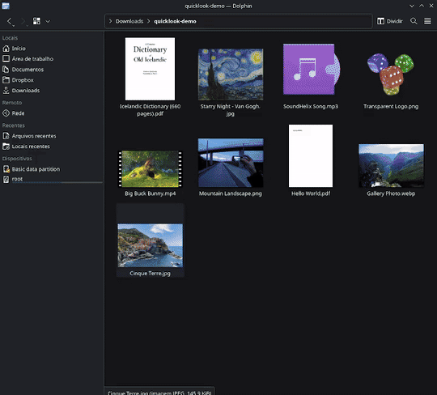

# Dolphin Quick Look

Dolphin Quick Look is an experimental patch for KDE Dolphin that previews supported local files inside the file view. Select a file and press `Space`; press `Space` or `Escape` to close the preview.

It is not an upstream Dolphin release or a distribution package. The installer builds one pinned Dolphin source revision (`b12eada7126627c43e463b1c1fff191233485d00`) so the patch is reproducible.

<p align="center">
  
</p>

## Current behavior

- `Space` opens the selected supported local file; it does not replace double-click activation.
- Images use the formats provided by the installed Qt image plugins.
- PDF support is optional and requires Qt PDF. Local PDF documents are loaded synchronously, while page rendering uses `QPdfPageRenderer` in multi-threaded mode. Files larger than 64 MiB are rejected.
- Video and audio support are optional and require Qt Multimedia plus working system codecs.
- Images and PDFs support wheel zoom from 1x to 5x, drag-to-pan, and right-click reset.
- PDF pages use viewport-sized pixel renders, a five-page preview cache, adjacent-page prefetch, and up to three password attempts. There is no fixed-DPI promise or PDF render timeout.
- The animation timer requests frames every 16 ms. Actual cadence depends on Qt, the compositor, display, and workload.
- Preview rendering is software-based with QPainter. This does not guarantee operation in a headless session: Dolphin still needs a working Qt graphical environment.
- Remote URLs are not previewed.

AVIF, HEIF/HEIC, JPEG XL and codecs are available only when the corresponding Qt or multimedia backend supports them. Quick Look does not provide its own HEIF diagnostic.

See [USAGE.md](USAGE.md) for controls and troubleshooting.

## Compatibility

The source pin currently declares CMake 3.16, Qt 6.4, KDE Frameworks 6.23, and C++20. Those minimums come from the pinned development snapshot; many stable distributions do not ship that KDE Frameworks version.

The patch is tested against the exact commit above, not arbitrary Dolphin releases or Dolphin `HEAD`. Updating the pin requires regenerating and testing the patch.

## Install on a mutable distribution

Install the development dependencies for the pinned Dolphin source first. A distribution's Dolphin build dependencies are a useful starting point; Qt PDF and Qt Multimedia development packages enable the optional backends.

```bash
git clone https://github.com/pir0c0pter0/dolphin-quicklook.git
cd dolphin-quicklook
./install.sh
```

The script shallow-fetches the pinned commit, applies the local patch, configures with `BUILD_TESTING=OFF`, and builds it. It asks before installing. Set `JOBS` to limit parallel compilation:

```bash
JOBS=4 ./install.sh
```

The default prefix follows an existing `dolphin` executable and otherwise uses `/usr`. System prefixes use `sudo`. A literal `$HOME/.local` prefix never uses `sudo` and is rejected if it is a symbolic link:

```bash
CMAKE_INSTALL_PREFIX="$HOME/.local" ./install.sh
```

A system-prefix install replaces or overlaps files owned by the distribution package. Test `build/dolphin/build/bin/dolphin` before accepting installation if that is unsuitable.

### Mutable uninstall

Keep the build directory: its CMake manifest identifies exactly what was installed.

```bash
./install.sh --uninstall
```

For a system prefix, reinstall Dolphin with the distribution package manager afterward to restore package-owned files. The uninstaller validates every manifest entry against the selected prefix before removing it.

## Install on atomic Fedora

Bazzite, Fedora Kinoite, and Fedora Silverblue have a read-only `/usr`. Use the atomic installer instead:

```bash
git clone https://github.com/pir0c0pter0/dolphin-quicklook.git
cd dolphin-quicklook
./scripts/install-bazzite.sh
```

It:

- verifies the host is OSTree-booted;
- creates a dedicated Fedora Toolbx matching the host `VERSION_ID` by default, recreating only that dedicated container after a release mismatch;
- validates the built binary against the host Qt/KF runtime before replacing the current install;
- builds with `BUILD_TESTING=OFF` and optional `JOBS`;
- installs to a real, non-symlinked `$HOME/.local` without `sudo`;
- points the desktop launcher and Dolphin user service at the user build.

An rpm-ostree deployment can temporarily lag behind the matching Fedora
repositories. If the host-runtime check reports a newer Qt/KF ABI, select an
older compatible build userspace explicitly, for example:

```bash
TOOLBOX_RELEASE=42 ./scripts/install-bazzite.sh
```

The mutable and atomic flows are intentionally separate.

### Atomic update hook

```bash
./scripts/update-bazzite-hook.sh --install
```

This installs a local snapshot containing the current patch, pinned source metadata, and atomic installer. At login, the user service compares the installed Dolphin RPM version with the last processed version and rebuilds only after it changes.

The hook never clones or executes a mutable remote branch. To approve a newer Quick Look revision, update this checkout, review it, and rerun `--install` to replace the local snapshot. Installer and hook share one `flock`; the service runs with `Nice=10`, `CPUWeight=20`, and `IOWeight=20`.

### Atomic uninstall

```bash
./scripts/install-bazzite.sh --uninstall
```

This removes only manifest-tracked files under `$HOME/.local`, the Quick Look user units/hook, and its installed snapshot. The system Dolphin remains untouched and becomes visible again.

## Verification

The repository CI checks:

- `bash -n` and ShellCheck for all shell scripts;
- that the patch applies cleanly to the shallow-fetched pinned Dolphin commit.

A full Dolphin build is intentionally not claimed by the portable CI job: it requires a KDE Frameworks 6.23 development environment. The installers leave upstream tests disabled because they install a feature build, not a Dolphin test suite.

## License

GPL-2.0-or-later, matching the added source headers. The complete license text is in [LICENSE](LICENSE) and [LICENSES/GPL-2.0-or-later.txt](LICENSES/GPL-2.0-or-later.txt).

## Credits

Built by [@pir0c0pter0](https://github.com/pir0c0pter0) as a native Dolphin contribution.
